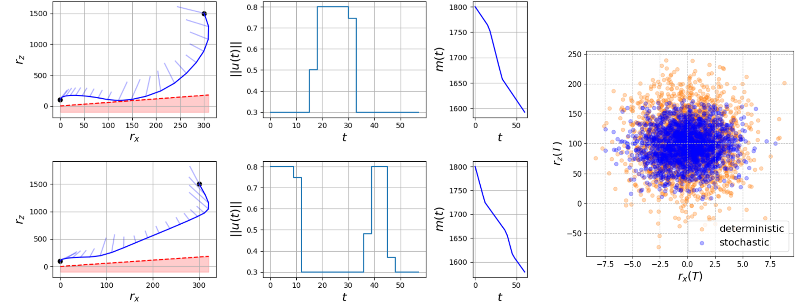
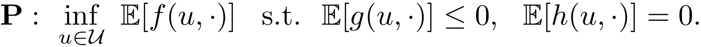
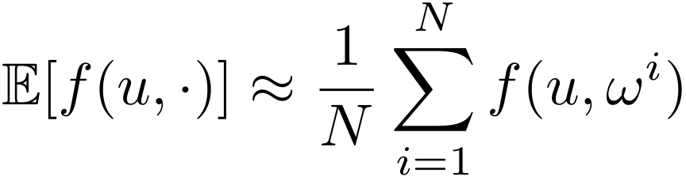
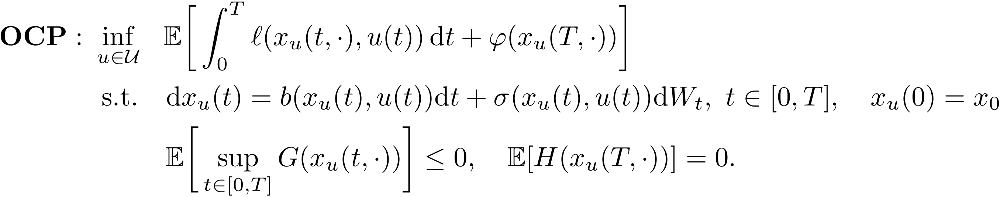

# Sample Average Approximation for Stochastic Programming with Equality Constraints

## About
Code to reproduce numerical results in T. Lew, R. Bonalli, and M. Pavone, "Sample Average Approximation for Stochastic Programming with Equality Constraints," SIAM Journal on Optimization, 2024. A preprint is available at [https://arxiv.org/abs/2206.09963](https://arxiv.org/abs/2206.09963).
<p align="center">
  
  <br /><em>Mars rocket-powered descent results.</em>
</p>
In this work, we apply the sample average approximation (SAA) to general stochastic programs
<p align="left">
  
</p>
The SAA approach consists of approximating this problem by replacing all expectations with Monte-Carlo estimates and solving the resulting deterministic optimization problem. For example, the cost is replaced with 
<p align="left">
  
</p>
In this paper, we prove asymptotic convergence properties of the approach as the number of samples increases. We also apply the approach to stochastic optimal control problems that take the form of
<p align="left">
  
</p>

## Setup
Requires Python>=3.6. All dependencies (i.e., numpy, cvxpy, and matplotlib) can be installed by running 
```bash
pip install -r requirements.txt
```
To reproduce the benchmark results (Section 6.1), run
```bash
python benchmark_main.py
```
Executing the script may take a long time. It can be run on different machines in parallel by specifying a subset of problems to solve (`python benchmark_main.py --programs_to_solve program_6,program_27`) and later plotting the results (`python benchmark_main.py --dont_compute_true_solutions --dont_compute_saa_solutions`).

For an example of trajectory optimization for a robotic manipulator, run
```bash
python manipulator.py
```

To reproduce the stochastic optimal control results (Section 6.2), run
```bash
python mars_powered_descent.py
```
This last implementation is short thanks to [CVXPY](https://www.cvxpy.org/) which easily interfaces with popular solvers such as [ECOS](https://github.com/embotech/ecos). This implementation is not optimized for speed and could be speeded up by (1) directly interfacing with the solver, (2) exploiting the sparsity of the problem (see, e.g., [OSQP](https://osqp.org/)), (3) parallelizing computations on a GPU, etc.
